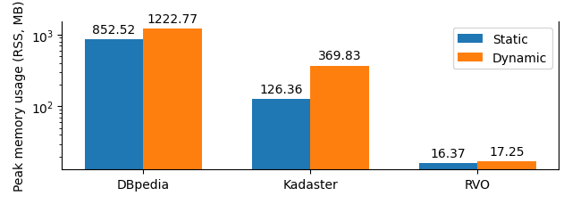

# Thesis Experiments

## Results

### RDF to HDT 

|Runtime|Peak RSS|
|---|---|
|||

### HDT to RDF 

|Runtime|Peak RSS|
|---|---|
|||

### Term prefix search

|Runtime|Peak RSS|
|---|---|
|||

### Triple-pattern search

|Runtime|Peak RSS|
|---|---|
|||

### Merging HDTs 

|Runtime|Peak RSS|
|---|---|
|||

### HDT subtraction

|Runtime|Peak RSS|
|---|---|
|||

### Triple replacements. 

|Runtime|Peak RSS|
|---|---|
|||
